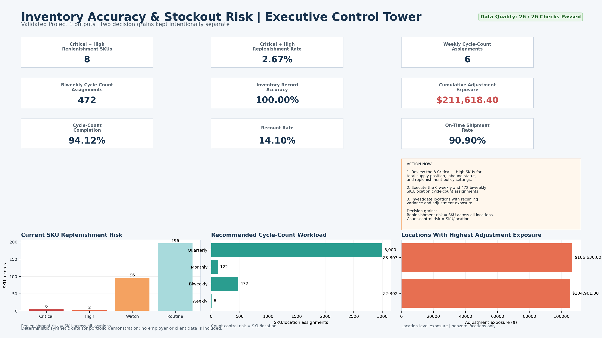

# William Bryan | Operations Reporting & Data Analytics

I build practical reporting, data-quality, inventory, and operations-analysis solutions using Excel, Power Query, SQL, Python, DuckDB, and business-intelligence tools.

My work focuses on turning operational data into clear management decisions: what needs attention, why it matters, who should own the action, and how success should be measured.

## Featured Operations Case Study

### Inventory Accuracy & Stockout Risk Analysis

A reproducible synthetic operations-analysis case study that separates two decisions that are often incorrectly combined:

1. SKU-level replenishment and stockout risk across all warehouse locations.
2. SKU/location-level cycle-count and inventory-control priorities.

**Key results**

- Synthetic 180-day warehouse/distribution dataset.
- SKU-level replenishment queue: 8 of 300 SKUs identified as Critical or High priority.
- SKU/location cycle-count queue: 6 Weekly, 472 Biweekly, 122 Monthly, and 3,000 Quarterly assignments.
- Inventory accuracy, adjustment-exposure, count-completion, recount-rate, and shipment-service KPIs.
- Data-quality validation: 26 checks passed.
- Reproducible Python reporting workflow, DuckDB reference SQL, data dictionary, executive brief, reporting methodology, dashboard package, and validation report.

**Decision supported:** Where should an inventory operation prioritize replenishment attention and cycle-count effort to reduce stockout exposure and inventory-control risk?

**Project links**

- [View the full case study](projects/01-inventory-accuracy-stockout-risk/README.md)
- [Two-page executive report](projects/01-inventory-accuracy-stockout-risk/reporting/inventory-accuracy-stockout-risk-report.pdf)
- [Executive brief](projects/01-inventory-accuracy-stockout-risk/dashboard/executive-brief.pdf)
- [Executive summary](projects/01-inventory-accuracy-stockout-risk/docs/executive_summary.md)
- [Reporting methodology](projects/01-inventory-accuracy-stockout-risk/docs/reporting_package_methodology.md)
- [Data dictionary](projects/01-inventory-accuracy-stockout-risk/docs/data_dictionary.md)
- [Validation report](projects/01-inventory-accuracy-stockout-risk/docs/pr_validation_report.md)
- [Action Queues & Evidence view](projects/01-inventory-accuracy-stockout-risk/reporting/02-action-queues-and-evidence.png)
- [SKU Replenishment Priorities](projects/01-inventory-accuracy-stockout-risk/outputs/sku_replenishment_priorities.csv)
- [SKU/Location Count Priorities](projects/01-inventory-accuracy-stockout-risk/outputs/sku_location_count_priorities.csv)

All Inventory Accuracy & Stockout Risk data is deterministic synthetic data. It does not contain employer, client, customer, confidential, personal, or proprietary information.

## What I Help Analyze

- Operations KPI reporting and dashboard design
- Inventory accuracy, reconciliation, cycle-count prioritization, and stockout risk
- Data cleanup, validation, exception management, and reporting controls
- Warehouse, distribution, throughput, backlog, and labor-utilization analysis
- CMMS, work-order, preventive-maintenance, downtime, and asset-reliability reporting
- Spreadsheet and recurring-report automation
- SQL, Python, DuckDB, Excel, Power Query, and business-intelligence workflows

## Portfolio Approach

This featured case study is built as a business decision-support package rather than a generic dashboard. It includes:

- A defined business problem and decision to support
- Documented data, assumptions, and limitations
- Reproducible analysis
- Clear KPI definitions and data-quality checks
- Stakeholder-ready reporting and dashboard design
- Evidence-based findings
- A specific operational recommendation, accountable owner, and success measures

## Additional Technical Projects

These projects demonstrate technical breadth in exploratory analysis, data tooling, SQL/Python workflows, and structured problem solving.

- [Athlete Events Analysis](projects/02-athlete_events/)
- [Car Sales Analysis](projects/03-car-sales/)
- [Heart Disease Analysis](projects/05-heart-disease/)
- [DuckDB CSV GUI](projects/04-duckdb-csv-gui/)

The featured inventory operations case study is the primary public work sample for analyst, reporting, inventory, systems, and technical-operations opportunities.

## Tools

Excel | Power Query | SQL | Python | pandas | DuckDB | Business Intelligence | GitHub

## Documentation

- [Portfolio Index](docs/portfolio_index.md)
- [Projects Catalog](docs/projects_catalog.md)
- [Data Analyst Portfolio Planning Guide](docs/data_analyst_portfolio_planning_guide.md)
- [Showcase Planning and Synchronization](docs/showcase%20planning%20and%20synchronization%20for%20effective%20monetization.md)

## Professional Direction

I am building toward Operations Analyst, Reporting Analyst, Data Quality Analyst, Inventory/Asset Analyst, Business Systems Analyst, Technical Operations Analyst, and CMMS/ERP/Application Support Analyst roles.

## Contact and Professional Links

- LinkedIn: [William Bryan](https://www.linkedin.com/in/william-bryan-omaha)

> This repository contains public portfolio work and synthetic demonstrations. It is not affiliated with or based on confidential information from any employer or client.
